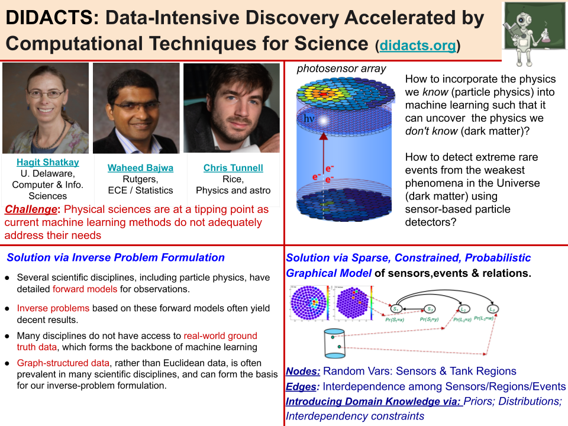

## Data-Intensive Discovery Accelerated by Computational Techniques for Science (DIDACTS)

How do we realize the full impact of machine learning in the physical sciences?  That is the core question that the DIDACTS project centers around.  The specific challenge is that physical sciences are at a tipping point whereas current machine learning methods do not adequately address their needs.  

## Research information

_(Click [here](https://github.com/DidactsOrg/didactsorg.github.io/blob/master/DIDACTS_one_slider.pdf) for a PDF of the above Quad Chart)_

As basic sciences including seismology, meteorology, materials science, and others, are becoming data intensive, we are reaching a tipping point, where identifying and utilizing meaningful signals in noisy data become increasingly difficult and require innovative, effective computational methods. A particularly challenging problem in the physics domain is the identification of Dark Matter (and properties of other elementary particles). Eighty-five percent of our Universe comprises something that we do not understand: Dark Matter. It binds the whole Universe together; without it, galaxies would not form and life would not exist. Yet we have no experimental knowledge of its properties.

Astroparticle physics experiments, characterized by massive amounts of extremely noisy spatiotemporal sensor data, provide an ideal development ground for computational methods that will be broadly applicable in experimental sciences. Our earlier studies have demonstrated that current neural network- based methods are not a good fit for encoding prior physical knowledge, and for faithfully representing physical constraints in these experiments. We propose going back to foundational probabilistic modeling and inverse problems, into which physical constraints and prior knowledge can be readily incorporated. This proposal brings together a well-qualified interdisciplinary team, comprising an astrophysicist working on particle physics detectors, a machine learning researcher with much interdisciplinary collaborative experience in the sciences, and an engineer with extensive expertise in signal processing, statistics. and inverse problems. The team is thus ideally positioned to make significant contributions advancing both data science and its impact on data-driven scientific disciplines.

### Publications and codes

_Publications and codes will be linked here once available.  Repositories will be within our [Github organization](https://github.com/DidactsOrg)._

### Project leads

Please feel free to reach out to any of our PIs to discuss possible collaboration.

* PI Christopher Tunnell, Rice University, Physics and Astronomy ([more info](http://astroparticle.rice.edu))
* Co-PI Waheed Bajwa, Rutgers, Electrical and Computing Engineering / Statistics ([more info](http://www.inspirelab.us))
* Co-PI Hagit Shatkay, U. Delaware, Computer and Information Sciences ([more info](https://www.eecis.udel.edu/~shatkay/))

### Workshops

A core part of our work is engaging with communities within the physical sciences that face similar challenges through a series of workshops each year.  So far, we have run the following workshops:

* [DANCE 2019](dance.rice.edu) focused on computational challenges to neutrino and dark-matter science

### Press

* Project start
  * [Delaware](https://www.udel.edu/udaily/2019/september/hagit-shatkay-dark-matter-data-national-science-foundation/)
  * [Rice](https://news.rice.edu/2019/09/18/deep-dive-for-dark-matter-may-aid-all-of-data-science/)
  * [Rutgers](https://soe.rutgers.edu/story/advancing-science-through-artificial-intelligence)
  * [KnowInnovation](http://knowinnovation.com/2019/11/dark-matter/)

### Funding

This work is supported by the National Science Foundation as part of it's Harnessing the Data Revolution Big Idea ([Soliciation 19-543](https://www.nsf.gov/pubs/2019/nsf19543/nsf19543.htm)) through awards [1940074](https://www.nsf.gov/awardsearch/showAward?AWD_ID=1940074&HistoricalAwards=false), [1940209](https://www.nsf.gov/awardsearch/showAward?AWD_ID=1940209&HistoricalAwards=false), and [1940080](https://www.nsf.gov/awardsearch/showAward?AWD_ID=1940080&HistoricalAwards=false).

